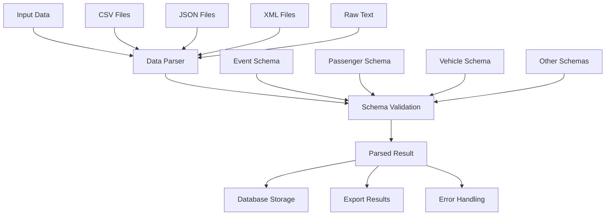

# Data Parsing System Documentation

## Overview

The TRS Data Parsing System is a comprehensive solution for parsing, validating, and transforming various data formats into structured database-ready data. It provides a robust foundation for handling different input formats (CSV, JSON, XML) and validating them against predefined schemas.

## Architecture



## Core Components

### 1. Parsing Schemas (`src/lib/parsing-schema.ts`)

The schema definitions use Zod for runtime validation and type safety. Each schema extends a base schema with common fields:

#### Base Schema Fields
- `id`: Optional unique identifier
- `source`: Source of the parsed data
- `timestamp`: When the data was parsed
- `rawData`: Original raw data before parsing
- `parsedAt`: When parsing completed
- `confidence`: Confidence score (0-1)
- `errors`: Array of parsing errors
- `warnings`: Array of parsing warnings

#### Available Schemas

##### Event Management
- **Event**: Basic event information (name, dates, location, etc.)
- **EventAccommodation**: Hotel and accommodation details

##### Passenger Management
- **Passenger**: Passenger information (name, passport, visa, etc.)

##### Fleet Management
- **Vehicle**: Vehicle details (registration, make, model, etc.)
- **Driver**: Driver information (license, experience, etc.)

##### Transport Schedules
- **TransportSchedule**: Ground transportation schedules
- **FlightSchedule**: Air travel schedules
- **HotelTransportation**: Hotel pickup/dropoff services

##### Task & Document Management
- **Task**: Task assignments and tracking
- **Document**: Document management and metadata

##### Specialized Services
- **Visa**: Visa application and status tracking
- **AAD**: Arrival and departure management
- **StaffStatistics**: Staff attendance and statistics
- **TransportReport**: Transportation performance reports
- **VAPP**: Vehicle assignment and passenger planning
- **ShuttleSystem**: Shuttle service management

### 2. Data Parser (`src/lib/data-parser.ts`)

The main parsing engine that handles different input formats and validates data against schemas.

#### Key Features
- **Multi-format Support**: CSV, JSON, XML, and raw text
- **Schema Validation**: Automatic validation against selected schemas
- **Error Handling**: Configurable error handling and recovery
- **Batch Processing**: Process multiple files efficiently
- **Progress Tracking**: Real-time progress monitoring
- **Confidence Scoring**: Automatic confidence calculation

#### Configuration Options
```typescript
{
  continueOnError: false,    // Continue parsing on errors
  maxErrors: 10,            // Maximum errors before stopping
  errorThreshold: 0.1,      // Error threshold ratio
  timeout: 30000,           // Parsing timeout in milliseconds
  batchSize: 100            // Batch processing size
}
```

### 3. React Component (`src/components/data-parser/DataParserComponent.tsx`)

A user-friendly interface for uploading and parsing data files.

#### Features
- **Drag & Drop**: Easy file upload interface
- **Schema Selection**: Choose appropriate schema for data
- **Real-time Processing**: Live progress updates
- **Result Display**: Comprehensive parsing results
- **Error Reporting**: Detailed error and warning information
- **Export Functionality**: Download parsed results
- **Configuration**: Adjustable parser settings

## Usage Examples

### Basic Parsing

```typescript
import { DataParser } from '@/lib/data-parser'

// Create parser instance
const parser = new DataParser()

// Parse CSV data
const results = await parser.parseCSV(csvContent, 'Passenger', {
  hasHeader: true,
  source: 'passenger-list.csv'
})

// Parse JSON data
const result = await parser.parseJSON(jsonContent, 'Event', {
  source: 'event-data.json'
})
```

### Quick Parsing Functions

```typescript
import { quickParse, quickParseCSV, quickParseJSON } from '@/lib/data-parser'

// Quick parse any data
const result = await quickParse(data, 'Vehicle')

// Quick CSV parsing
const results = await quickParseCSV(csvContent, 'Passenger')

// Quick JSON parsing
const result = await quickParseJSON(jsonContent, 'Event')
```

### Batch Processing

```typescript
const files = [
  { content: csvData, format: 'csv', schemaType: 'Passenger' },
  { content: jsonData, format: 'json', schemaType: 'Event' }
]

const results = await parser.processBatch(files, {
  onProgress: (completed, total) => {
    console.log(`Processed ${completed}/${total} files`)
  },
  onError: (error, fileIndex) => {
    console.error(`Error in file ${fileIndex}:`, error)
  }
})
```

### Schema Validation

```typescript
// Validate data against schema
const validation = parser.validateData(data, 'Passenger')

if (validation.isValid) {
  console.log('Data is valid')
} else {
  console.log('Validation errors:', validation.errors)
}

// Get schema information
const schemaInfo = parser.getSchemaInfo('Passenger')
console.log('Required fields:', schemaInfo.requiredFields)
```

## Input Format Support

### CSV Format
- **Headers**: Optional, automatically detected
- **Delimiters**: Configurable (default: comma)
- **Encoding**: UTF-8 recommended
- **Special Characters**: Handled automatically

Example CSV:
```csv
firstName,lastName,dateOfBirth,nationality,passportNumber
John,Doe,1990-01-01,US,123456789
Jane,Smith,1985-05-15,CA,987654321
```

### JSON Format
- **Structure**: Must match schema structure
- **Types**: Automatic type conversion
- **Validation**: Schema-based validation
- **Nesting**: Supports nested objects and arrays

Example JSON:
```json
{
  "firstName": "John",
  "lastName": "Doe",
  "dateOfBirth": "1990-01-01",
  "nationality": "US",
  "passportNumber": "123456789"
}
```

### XML Format
- **Structure**: Basic XML parsing support
- **Tags**: Automatic tag-to-field mapping
- **Attributes**: Basic attribute support
- **Complexity**: Limited to simple XML structures

Example XML:
```xml
<passenger>
  <firstName>John</firstName>
  <lastName>Doe</lastName>
  <dateOfBirth>1990-01-01</dateOfBirth>
  <nationality>US</nationality>
  <passportNumber>123456789</passportNumber>
</passenger>
```

## Error Handling

### Error Types
1. **Schema Validation Errors**: Data doesn't match schema requirements
2. **Format Errors**: Invalid input format (malformed CSV, JSON, XML)
3. **Parsing Errors**: Issues during data transformation
4. **Timeout Errors**: Processing takes too long

### Error Recovery
- **Continue on Error**: Process remaining data despite errors
- **Error Thresholds**: Stop processing if error rate is too high
- **Detailed Reporting**: Comprehensive error information
- **Partial Results**: Return successfully parsed data

### Error Reporting
```typescript
{
  success: false,
  errors: [
    "firstName: Required",
    "dateOfBirth: Invalid date format"
  ],
  warnings: [
    "passportNumber: Missing, using default"
  ],
  metadata: {
    parsingTime: 150,
    sourceFormat: "csv",
    confidence: 0.6
  }
}
```

## Performance Optimization

### Batch Processing
- Process multiple files efficiently
- Configurable batch sizes
- Memory management for large datasets

### Caching
- Schema validation caching
- Parsed result caching
- Configuration caching

### Progress Tracking
- Real-time progress updates
- Estimated time remaining
- Resource usage monitoring

## Integration with Database

### Data Flow
1. **Parse Input**: Convert raw data to structured format
2. **Validate Schema**: Ensure data meets requirements
3. **Transform Data**: Convert to database format
4. **Store Data**: Insert into appropriate database tables

### Database Mapping
Each schema corresponds to specific database tables:
- **Event** → `events` table
- **Passenger** → `passengers` table
- **Vehicle** → `vehicles` table
- **Driver** → `drivers` table

### Transaction Support
- Batch inserts for efficiency
- Rollback on errors
- Data consistency checks

## Configuration and Customization

### Environment Variables
```bash
# Parser configuration
PARSER_TIMEOUT=30000
PARSER_MAX_ERRORS=10
PARSER_BATCH_SIZE=100
PARSER_CONTINUE_ON_ERROR=false
```

### Custom Schemas
```typescript
import { z } from 'zod'
import { BaseParsedDataSchema } from '@/lib/parsing-schema'

// Create custom schema
export const CustomSchema = z.object({
  ...BaseParsedDataSchema.shape,
  customField: z.string(),
  customNumber: z.number()
})

// Add to schemas
ParsingSchemas.Custom = CustomSchema
```

### Parser Extensions
```typescript
class CustomDataParser extends DataParser {
  async parseCustomFormat(data: string, schemaType: keyof typeof ParsingSchemas) {
    // Custom parsing logic
    const parsedData = this.customParse(data)
    return this.parseData(parsedData, schemaType)
  }
  
  private customParse(data: string) {
    // Implementation
  }
}
```

## Testing and Validation

### Unit Tests
- Schema validation tests
- Parser functionality tests
- Error handling tests

### Integration Tests
- End-to-end parsing tests
- Database integration tests
- Performance tests

### Data Quality Tests
- Schema compliance checks
- Data integrity validation
- Performance benchmarking

## Troubleshooting

### Common Issues

#### Schema Validation Failures
- Check required fields are present
- Verify data types match schema
- Ensure date formats are correct

#### Performance Issues
- Reduce batch size
- Increase timeout values
- Check memory usage

#### Format Detection Issues
- Verify file extensions
- Check file content structure
- Use explicit format specification

### Debug Mode
```typescript
const parser = new DataParser({
  debug: true,
  continueOnError: true
})
```

## Best Practices

### Data Preparation
1. **Clean Input Data**: Remove invalid characters and formatting
2. **Standardize Formats**: Use consistent date and number formats
3. **Validate Early**: Check data quality before parsing
4. **Handle Edge Cases**: Plan for missing or malformed data

### Schema Design
1. **Keep Schemas Simple**: Avoid overly complex validation rules
2. **Use Descriptive Names**: Clear field and schema names
3. **Provide Defaults**: Sensible default values where appropriate
4. **Document Requirements**: Clear documentation for each schema

### Performance
1. **Batch Processing**: Process multiple files together
2. **Memory Management**: Monitor memory usage for large files
3. **Error Handling**: Configure appropriate error thresholds
4. **Progress Tracking**: Provide user feedback for long operations

### Security
1. **Input Validation**: Validate all input data
2. **File Size Limits**: Set appropriate file size restrictions
3. **Type Safety**: Use TypeScript for compile-time validation
4. **Error Sanitization**: Don't expose internal errors to users

## Future Enhancements

### Planned Features
- **Machine Learning**: AI-powered data format detection
- **Advanced Validation**: Complex business rule validation
- **Data Transformation**: Advanced data transformation pipelines
- **Real-time Processing**: Stream processing capabilities
- **API Integration**: REST API for parsing services

### Extensibility
- **Plugin System**: Custom parser plugins
- **Schema Registry**: Dynamic schema management
- **Format Support**: Additional input formats
- **Export Formats**: Multiple output formats

## Support and Maintenance

### Documentation
- API reference
- Schema documentation
- Example implementations
- Troubleshooting guides

### Community
- Issue reporting
- Feature requests
- Code contributions
- Discussion forums

### Updates
- Regular schema updates
- Performance improvements
- Bug fixes
- Security patches
