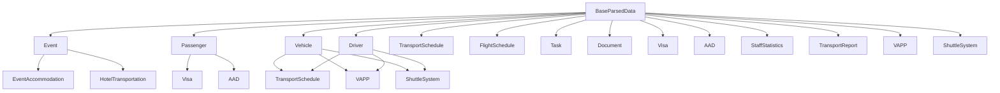

# TRS Parsing Schemas Reference

## Overview

This document provides a comprehensive reference for all parsing schemas used in the TRS Data Parsing System. Each schema defines the structure and validation rules for different types of data that can be parsed and stored in the database.

## Schema Categories

The schemas are organized into the following categories:

- **Event Management** - Event and accommodation data
- **Passenger Management** - Passenger information and details
- **Fleet Management** - Vehicle and driver data
- **Transport Schedules** - Ground and air transportation schedules
- **Task Management** - Task assignments and tracking
- **Document Management** - Document metadata and storage
- **Visa Management** - Visa application and status
- **AAD Management** - Arrival and departure tracking
- **Statistics and Reports** - Staff and transport statistics
- **Planning and Coordination** - Vehicle assignment and shuttle systems

---

## Base Schema

### BaseParsedData

**Description**: Base schema for all parsed data with common fields

| Field | Type | Required | Default | Description |
|-------|------|----------|---------|-------------|
| `id` | string | ❌ | - | Optional unique identifier |
| `source` | string | ✅ | - | Source of the parsed data |
| `timestamp` | date | ❌ | current_date | When the data was parsed |
| `rawData` | string | ✅ | - | Original raw data before parsing |
| `parsedAt` | date | ❌ | current_date | When parsing completed |
| `confidence` | number | ❌ | 0.8 | Confidence score (0-1) |
| `errors` | array[string] | ❌ | [] | Parsing errors encountered |
| `warnings` | array[string] | ❌ | [] | Parsing warnings |

---

## Event Management Schemas

### Event

**Description**: Event data parsing schema  
**Extends**: BaseParsedData

| Field | Type | Required | Default | Description |
|-------|------|----------|---------|-------------|
| `eventId` | string | ✅ | - | Unique event identifier |
| `eventName` | string | ✅ | - | Name of the event |
| `eventType` | enum | ✅ | - | Type: conference, meeting, travel, training, other |
| `startDate` | date | ✅ | - | Event start date |
| `endDate` | date | ✅ | - | Event end date |
| `location` | string | ❌ | - | Event location |
| `description` | string | ❌ | - | Event description |
| `status` | enum | ❌ | planned | Status: planned, active, completed, cancelled |
| `priority` | enum | ❌ | medium | Priority: low, medium, high, critical |
| `attendees` | array[string] | ❌ | [] | List of attendee IDs |
| `budget` | number | ❌ | - | Event budget |
| `organizer` | string | ✅ | - | Event organizer ID |

### EventAccommodation

**Description**: Event accommodation parsing schema  
**Extends**: BaseParsedData

| Field | Type | Required | Default | Description |
|-------|------|----------|---------|-------------|
| `eventId` | string | ✅ | - | Associated event ID |
| `accommodationId` | string | ✅ | - | Unique accommodation identifier |
| `hotelName` | string | ✅ | - | Hotel name |
| `address` | string | ✅ | - | Hotel address |
| `checkInDate` | date | ✅ | - | Check-in date |
| `checkOutDate` | date | ✅ | - | Check-out date |
| `roomType` | string | ✅ | - | Type of room |
| `roomNumber` | string | ❌ | - | Room number |
| `guestCount` | number | ✅ | - | Number of guests (min: 1) |
| `status` | enum | ✅ | - | Status: reserved, confirmed, checked-in, checked-out, cancelled |
| `cost` | number | ❌ | - | Accommodation cost |
| `specialRequests` | string | ❌ | - | Special accommodation requests |

---

## Passenger Management Schemas

### Passenger

**Description**: Passenger data parsing schema  
**Extends**: BaseParsedData

| Field | Type | Required | Default | Description |
|-------|------|----------|---------|-------------|
| `passengerId` | string | ✅ | - | Unique passenger identifier |
| `firstName` | string | ✅ | - | Passenger first name |
| `lastName` | string | ✅ | - | Passenger last name |
| `dateOfBirth` | date | ✅ | - | Passenger date of birth |
| `nationality` | string | ✅ | - | Passenger nationality |
| `passportNumber` | string | ❌ | - | Passport number |
| `passportExpiry` | date | ❌ | - | Passport expiry date |
| `visaNumber` | string | ❌ | - | Visa number |
| `visaExpiry` | date | ❌ | - | Visa expiry date |
| `contactPhone` | string | ❌ | - | Contact phone number |
| `contactEmail` | email | ❌ | - | Contact email |
| `emergencyContact` | object | ❌ | - | Emergency contact information |
| `dietaryRestrictions` | array[string] | ❌ | [] | Dietary restrictions |
| `medicalConditions` | array[string] | ❌ | [] | Medical conditions |
| `specialAssistance` | boolean | ❌ | false | Requires special assistance |
| `status` | enum | ❌ | active | Status: active, inactive, suspended |

**Emergency Contact Object:**
- `name`: string
- `relationship`: string  
- `phone`: string
- `email`: email (optional)

---

## Fleet Management Schemas

### Vehicle

**Description**: Vehicle data parsing schema  
**Extends**: BaseParsedData

| Field | Type | Required | Default | Description |
|-------|------|----------|---------|-------------|
| `vehicleId` | string | ✅ | - | Unique vehicle identifier |
| `registrationNumber` | string | ✅ | - | Vehicle registration number |
| `make` | string | ✅ | - | Vehicle make |
| `model` | string | ✅ | - | Vehicle model |
| `year` | number | ✅ | - | Vehicle year (1900-current+1) |
| `color` | string | ✅ | - | Vehicle color |
| `capacity` | number | ✅ | - | Passenger capacity (min: 1) |
| `fuelType` | enum | ✅ | - | Type: petrol, diesel, electric, hybrid, other |
| `transmission` | enum | ✅ | - | Type: manual, automatic |
| `status` | enum | ❌ | available | Status: available, in-use, maintenance, out-of-service |
| `lastMaintenance` | date | ❌ | - | Last maintenance date |
| `nextMaintenance` | date | ❌ | - | Next maintenance due date |
| `mileage` | number | ✅ | - | Current mileage (min: 0) |
| `fuelLevel` | number | ❌ | - | Current fuel level % (0-100) |
| `location` | string | ❌ | - | Current vehicle location |
| `assignedDriver` | string | ❌ | - | Currently assigned driver ID |

### Driver

**Description**: Driver data parsing schema  
**Extends**: BaseParsedData

| Field | Type | Required | Default | Description |
|-------|------|----------|---------|-------------|
| `driverId` | string | ✅ | - | Unique driver identifier |
| `employeeId` | string | ✅ | - | Employee ID |
| `firstName` | string | ✅ | - | Driver first name |
| `lastName` | string | ✅ | - | Driver last name |
| `dateOfBirth` | date | ✅ | - | Driver date of birth |
| `licenseNumber` | string | ✅ | - | Driver license number |
| `licenseType` | enum | ✅ | - | Type: A, B, C, D, E |
| `licenseExpiry` | date | ✅ | - | License expiry date |
| `experienceYears` | number | ✅ | - | Years of driving experience (min: 0) |
| `contactPhone` | string | ✅ | - | Contact phone number |
| `contactEmail` | email | ✅ | - | Contact email |
| `emergencyContact` | object | ✅ | - | Emergency contact information |
| `medicalCertificate` | object | ❌ | - | Medical certificate details |
| `status` | enum | ❌ | active | Status: active, inactive, suspended, on-leave |
| `assignedVehicle` | string | ❌ | - | Currently assigned vehicle ID |
| `currentLocation` | string | ❌ | - | Current driver location |

**Emergency Contact Object:**
- `name`: string
- `relationship`: string
- `phone`: string
- `email`: email (optional)

**Medical Certificate Object:**
- `number`: string
- `expiryDate`: date
- `issuingAuthority`: string

---

## Transport Schedule Schemas

### TransportSchedule

**Description**: Transport schedule parsing schema  
**Extends**: BaseParsedData

| Field | Type | Required | Default | Description |
|-------|------|----------|---------|-------------|
| `scheduleId` | string | ✅ | - | Unique schedule identifier |
| `eventId` | string | ✅ | - | Associated event ID |
| `routeName` | string | ✅ | - | Route name or description |
| `departureLocation` | string | ✅ | - | Departure location |
| `arrivalLocation` | string | ✅ | - | Arrival location |
| `departureTime` | date | ✅ | - | Scheduled departure time |
| `arrivalTime` | date | ✅ | - | Scheduled arrival time |
| `vehicleId` | string | ❌ | - | Assigned vehicle ID |
| `driverId` | string | ❌ | - | Assigned driver ID |
| `passengerCount` | number | ✅ | - | Number of passengers (min: 0) |
| `maxCapacity` | number | ✅ | - | Maximum passenger capacity (min: 1) |
| `status` | enum | ❌ | scheduled | Status: scheduled, in-progress, completed, cancelled, delayed |
| `delayMinutes` | number | ❌ | 0 | Delay in minutes (min: 0) |
| `notes` | string | ❌ | - | Additional notes |
| `specialInstructions` | string | ❌ | - | Special instructions for driver |

### FlightSchedule

**Description**: Flight schedule parsing schema  
**Extends**: BaseParsedData

| Field | Type | Required | Default | Description |
|-------|------|----------|---------|-------------|
| `flightId` | string | ✅ | - | Unique flight identifier |
| `eventId` | string | ✅ | - | Associated event ID |
| `airline` | string | ✅ | - | Airline name |
| `flightNumber` | string | ✅ | - | Flight number |
| `departureAirport` | string | ✅ | - | Departure airport code |
| `arrivalAirport` | string | ✅ | - | Arrival airport code |
| `departureTime` | date | ✅ | - | Scheduled departure time |
| `arrivalTime` | date | ✅ | - | Scheduled arrival time |
| `aircraftType` | string | ❌ | - | Aircraft type |
| `seatClass` | enum | ❌ | economy | Class: economy, business, first |
| `passengerCount` | number | ✅ | - | Number of passengers (min: 1) |
| `status` | enum | ❌ | scheduled | Status: scheduled, boarding, departed, arrived, cancelled, delayed |
| `gate` | string | ❌ | - | Departure gate |
| `terminal` | string | ❌ | - | Terminal number |
| `baggageClaim` | string | ❌ | - | Baggage claim information |
| `delayMinutes` | number | ❌ | 0 | Delay in minutes (min: 0) |
| `cancellationReason` | string | ❌ | - | Reason for cancellation if applicable |

### HotelTransportation

**Description**: Hotel transportation parsing schema  
**Extends**: BaseParsedData

| Field | Type | Required | Default | Description |
|-------|------|----------|---------|-------------|
| `transportationId` | string | ✅ | - | Unique transportation identifier |
| `eventId` | string | ✅ | - | Associated event ID |
| `hotelName` | string | ✅ | - | Hotel name |
| `hotelAddress` | string | ✅ | - | Hotel address |
| `pickupTime` | date | ✅ | - | Scheduled pickup time |
| `dropoffTime` | date | ✅ | - | Scheduled dropoff time |
| `vehicleId` | string | ❌ | - | Assigned vehicle ID |
| `driverId` | string | ❌ | - | Assigned driver ID |
| `passengerCount` | number | ✅ | - | Number of passengers (min: 1) |
| `pickupLocation` | string | ✅ | - | Pickup location |
| `dropoffLocation` | string | ✅ | - | Dropoff location |
| `status` | enum | ❌ | scheduled | Status: scheduled, in-progress, completed, cancelled |
| `specialRequests` | string | ❌ | - | Special transportation requests |
| `notes` | string | ❌ | - | Additional notes |

---

## Task Management Schemas

### Task

**Description**: Task data parsing schema  
**Extends**: BaseParsedData

| Field | Type | Required | Default | Description |
|-------|------|----------|---------|-------------|
| `taskId` | string | ✅ | - | Unique task identifier |
| `eventId` | string | ✅ | - | Associated event ID |
| `title` | string | ✅ | - | Task title |
| `description` | string | ✅ | - | Task description |
| `assignedTo` | string | ✅ | - | Assigned user ID |
| `assignedBy` | string | ✅ | - | User who assigned the task |
| `priority` | enum | ❌ | medium | Priority: low, medium, high, critical |
| `status` | enum | ❌ | pending | Status: pending, in-progress, completed, cancelled, on-hold |
| `dueDate` | date | ✅ | - | Task due date |
| `startDate` | date | ❌ | - | Task start date |
| `completionDate` | date | ❌ | - | Task completion date |
| `estimatedHours` | number | ❌ | - | Estimated hours to complete (min: 0) |
| `actualHours` | number | ❌ | - | Actual hours spent (min: 0) |
| `dependencies` | array[string] | ❌ | [] | Dependent task IDs |
| `tags` | array[string] | ❌ | [] | Task tags |
| `attachments` | array[string] | ❌ | [] | Attachment file IDs |
| `notes` | string | ❌ | - | Additional notes |

---

## Document Management Schemas

### Document

**Description**: Document parsing schema  
**Extends**: BaseParsedData

| Field | Type | Required | Default | Description |
|-------|------|----------|---------|-------------|
| `documentId` | string | ✅ | - | Unique document identifier |
| `eventId` | string | ✅ | - | Associated event ID |
| `title` | string | ✅ | - | Document title |
| `description` | string | ❌ | - | Document description |
| `fileName` | string | ✅ | - | Original file name |
| `filePath` | string | ✅ | - | File storage path |
| `fileSize` | number | ✅ | - | File size in bytes (min: 0) |
| `mimeType` | string | ✅ | - | File MIME type |
| `category` | enum | ✅ | - | Category: passport, visa, ticket, invoice, contract, other |
| `status` | enum | ❌ | pending | Status: draft, pending, approved, rejected, expired |
| `uploadedBy` | string | ✅ | - | User who uploaded the document |
| `uploadedAt` | date | ✅ | - | Upload timestamp |
| `expiryDate` | date | ❌ | - | Document expiry date |
| `tags` | array[string] | ❌ | [] | Document tags |
| `version` | string | ❌ | 1.0 | Document version |
| `isPublic` | boolean | ❌ | false | Whether document is publicly accessible |

---

## Visa Management Schemas

### Visa

**Description**: Visa data parsing schema  
**Extends**: BaseParsedData

| Field | Type | Required | Default | Description |
|-------|------|----------|---------|-------------|
| `visaId` | string | ✅ | - | Unique visa identifier |
| `eventId` | string | ✅ | - | Associated event ID |
| `passengerId` | string | ✅ | - | Associated passenger ID |
| `visaType` | enum | ✅ | - | Type: tourist, business, work, student, transit, other |
| `country` | string | ✅ | - | Visa issuing country |
| `visaNumber` | string | ✅ | - | Visa number |
| `issueDate` | date | ✅ | - | Visa issue date |
| `expiryDate` | date | ✅ | - | Visa expiry date |
| `entryType` | enum | ✅ | - | Type: single, double, multiple |
| `status` | enum | ❌ | pending | Status: pending, approved, rejected, expired, cancelled |
| `processingTime` | number | ❌ | - | Processing time in days (min: 0) |
| `cost` | number | ❌ | - | Visa cost (min: 0) |
| `requirements` | array[string] | ❌ | [] | Visa requirements |
| `notes` | string | ❌ | - | Additional notes |
| `applicationDate` | date | ❌ | - | Application submission date |
| `approvalDate` | date | ❌ | - | Approval date |

---

## AAD Management Schemas

### AAD

**Description**: AAD (Arrival and Departure) data parsing schema  
**Extends**: BaseParsedData

| Field | Type | Required | Default | Description |
|-------|------|----------|---------|-------------|
| `aadId` | string | ✅ | - | Unique AAD identifier |
| `eventId` | string | ✅ | - | Associated event ID |
| `passengerId` | string | ✅ | - | Associated passenger ID |
| `arrivalDate` | date | ✅ | - | Arrival date |
| `departureDate` | date | ✅ | - | Departure date |
| `arrivalTime` | string | ✅ | - | Arrival time |
| `departureTime` | string | ✅ | - | Departure time |
| `arrivalLocation` | string | ✅ | - | Arrival location |
| `departureLocation` | string | ✅ | - | Departure location |
| `transportMode` | enum | ✅ | - | Mode: air, land, sea |
| `status` | enum | ❌ | scheduled | Status: scheduled, in-progress, completed, cancelled, delayed |
| `delayMinutes` | number | ❌ | 0 | Delay in minutes (min: 0) |
| `notes` | string | ❌ | - | Additional notes |
| `specialAssistance` | boolean | ❌ | false | Requires special assistance |

---

## Statistics and Reports Schemas

### StaffStatistics

**Description**: Staff statistics parsing schema  
**Extends**: BaseParsedData

| Field | Type | Required | Default | Description |
|-------|------|----------|---------|-------------|
| `statisticsId` | string | ✅ | - | Unique statistics identifier |
| `eventId` | string | ✅ | - | Associated event ID |
| `date` | date | ✅ | - | Statistics date |
| `totalStaff` | number | ✅ | - | Total staff count (min: 0) |
| `presentStaff` | number | ✅ | - | Present staff count (min: 0) |
| `absentStaff` | number | ✅ | - | Absent staff count (min: 0) |
| `onLeaveStaff` | number | ✅ | - | Staff on leave count (min: 0) |
| `sickStaff` | number | ✅ | - | Sick staff count (min: 0) |
| `overtimeHours` | number | ✅ | - | Total overtime hours (min: 0) |
| `departmentBreakdown` | object | ❌ | {} | Staff count by department |
| `notes` | string | ❌ | - | Additional notes |

### TransportReport

**Description**: Transport report parsing schema  
**Extends**: BaseParsedData

| Field | Type | Required | Default | Description |
|-------|------|----------|---------|-------------|
| `reportId` | string | ✅ | - | Unique report identifier |
| `eventId` | string | ✅ | - | Associated event ID |
| `reportDate` | date | ✅ | - | Report date |
| `reportType` | enum | ✅ | - | Type: daily, weekly, monthly, incident, summary |
| `totalTrips` | number | ✅ | - | Total trips completed (min: 0) |
| `totalPassengers` | number | ✅ | - | Total passengers transported (min: 0) |
| `totalDistance` | number | ✅ | - | Total distance covered in km (min: 0) |
| `totalFuelUsed` | number | ✅ | - | Total fuel used in liters (min: 0) |
| `totalCost` | number | ✅ | - | Total transport cost (min: 0) |
| `incidents` | array[object] | ❌ | [] | Transport incidents |
| `vehicleUtilization` | object | ❌ | {} | Vehicle utilization by vehicle ID |
| `driverPerformance` | object | ❌ | {} | Driver performance metrics |
| `notes` | string | ❌ | - | Additional notes |

**Incident Object:**
- `description`: string
- `severity`: enum (low, medium, high, critical)
- `resolution`: string (optional)

---

## Planning and Coordination Schemas

### VAPP

**Description**: VAPP (Vehicle Assignment and Passenger Planning) data parsing schema  
**Extends**: BaseParsedData

| Field | Type | Required | Default | Description |
|-------|------|----------|---------|-------------|
| `vappId` | string | ✅ | - | Unique VAPP identifier |
| `eventId` | string | ✅ | - | Associated event ID |
| `vehicleId` | string | ✅ | - | Assigned vehicle ID |
| `driverId` | string | ✅ | - | Assigned driver ID |
| `route` | object | ✅ | - | Route information |
| `schedule` | object | ✅ | - | Schedule information |
| `passengers` | array[string] | ❌ | [] | Assigned passenger IDs |
| `status` | enum | ❌ | planned | Status: planned, in-progress, completed, cancelled |
| `notes` | string | ❌ | - | Additional notes |

**Route Object:**
- `startLocation`: string
- `endLocation`: string
- `waypoints`: array[string]
- `estimatedDistance`: number (min: 0)
- `estimatedDuration`: number (min: 0)

**Schedule Object:**
- `departureTime`: date
- `arrivalTime`: date
- `pickupStops`: array[object]
- `dropoffStops`: array[object]

### ShuttleSystem

**Description**: Shuttle system parsing schema  
**Extends**: BaseParsedData

| Field | Type | Required | Default | Description |
|-------|------|----------|---------|-------------|
| `shuttleId` | string | ✅ | - | Unique shuttle identifier |
| `eventId` | string | ✅ | - | Associated event ID |
| `routeName` | string | ✅ | - | Shuttle route name |
| `vehicleId` | string | ✅ | - | Assigned vehicle ID |
| `driverId` | string | ✅ | - | Assigned driver ID |
| `schedule` | object | ✅ | - | Shuttle schedule |
| `capacity` | number | ✅ | - | Shuttle capacity (min: 1) |
| `currentPassengers` | number | ✅ | - | Current passenger count (min: 0) |
| `status` | enum | ❌ | active | Status: active, inactive, maintenance |
| `notes` | string | ❌ | - | Additional notes |

**Schedule Object:**
- `startTime`: date
- `endTime`: date
- `frequency`: number (min: 1) - Frequency in minutes
- `stops`: array[object]

---

## Field Types Reference

### Basic Types

| Type | Description | Examples |
|------|-------------|----------|
| `string` | Text data | "John Doe", "ABC123" |
| `number` | Numeric data | 42, 3.14, -5 |
| `date` | Date and time data | 2024-01-15, 2024-01-15T10:30:00Z |
| `boolean` | True/false values | true, false |
| `email` | Email address format | "user@example.com" |

### Complex Types

| Type | Description | Examples |
|------|-------------|----------|
| `enum` | Predefined value options | ["low", "medium", "high"] |
| `array` | List of values | ["item1", "item2"] |
| `object` | Nested object structure | { "name": "value" } |

### Validation Rules

| Rule | Description | Example |
|------|-------------|---------|
| `required` | Field must be present | ✅ Required field |
| `optional` | Field can be omitted | ❌ Optional field |
| `min` | Minimum value constraint | `min: 0` |
| `max` | Maximum value constraint | `max: 100` |
| `default` | Default value if not provided | `default: "medium"` |
| `extends` | Inherits from base schema | `extends: BaseParsedData` |

---

## Usage Examples

### Basic Schema Usage

```typescript
import { ParsingSchemas } from '@/lib/parsing-schema'

// Validate data against Event schema
const eventData = {
  eventId: "EVT001",
  eventName: "Annual Conference",
  eventType: "conference",
  startDate: new Date("2024-06-15"),
  endDate: new Date("2024-06-17"),
  organizer: "ORG001"
}

const result = ParsingSchemas.Event.safeParse(eventData)
if (result.success) {
  console.log("Valid event data:", result.data)
} else {
  console.log("Validation errors:", result.error.errors)
}
```

### Schema Information

```typescript
import { DataParser } from '@/lib/data-parser'

const parser = new DataParser()
const schemaInfo = parser.getSchemaInfo('Passenger')

console.log("Schema name:", schemaInfo.name)
console.log("Total fields:", schemaInfo.fields.length)
console.log("Required fields:", schemaInfo.requiredFields)
```

---

## Schema Relationships



---

## Best Practices

### Schema Design
1. **Keep schemas focused** - Each schema should represent a single entity type
2. **Use descriptive names** - Field names should clearly indicate their purpose
3. **Provide defaults** - Set sensible default values for optional fields
4. **Validate constraints** - Use min/max values and enums for data integrity

### Data Validation
1. **Validate early** - Check data against schemas as soon as possible
2. **Handle errors gracefully** - Provide clear error messages for validation failures
3. **Use type safety** - Leverage TypeScript for compile-time validation
4. **Test thoroughly** - Validate schemas with various data scenarios

### Performance
1. **Batch processing** - Process multiple records together when possible
2. **Lazy validation** - Only validate fields that are actually used
3. **Cache schemas** - Reuse schema instances for repeated validations
4. **Monitor memory** - Be aware of memory usage with large datasets

---

## Troubleshooting

### Common Issues

**Schema Validation Failures**
- Check that all required fields are present
- Verify data types match schema definitions
- Ensure enum values are from the allowed list
- Check date format compatibility

**Performance Issues**
- Reduce batch size for large datasets
- Increase timeout values for complex validations
- Monitor memory usage during parsing
- Use streaming for very large files

**Integration Issues**
- Verify schema versions are compatible
- Check field mapping between systems
- Ensure data format consistency
- Validate API response structures

---

## Version History

| Version | Date | Changes |
|---------|------|---------|
| 1.0.0 | 2024-01-15 | Initial schema definitions |
| 1.0.1 | 2024-01-16 | Added missing field descriptions |
| 1.0.2 | 2024-01-17 | Enhanced validation rules |

---

## Support

For questions about these schemas or the parsing system:

- **Documentation**: Check the main `DATA_PARSING_SYSTEM.md` file
- **Examples**: Review the component implementations
- **Issues**: Report problems through the project issue tracker
- **Contributions**: Submit improvements via pull requests

---

*This document is automatically generated from the schema definitions. For the most up-to-date information, refer to the source code in `src/lib/parsing-schema.ts`.*
